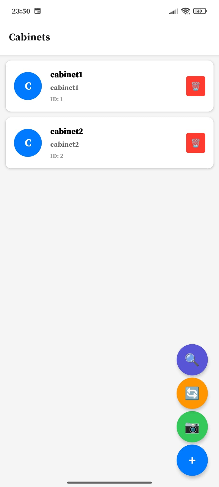
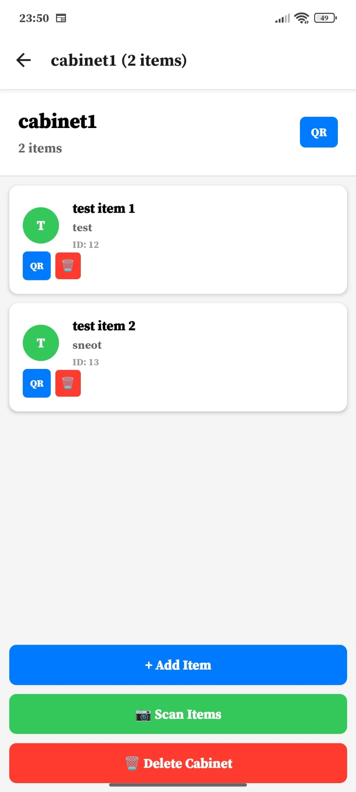
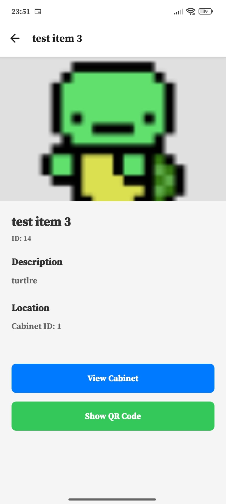
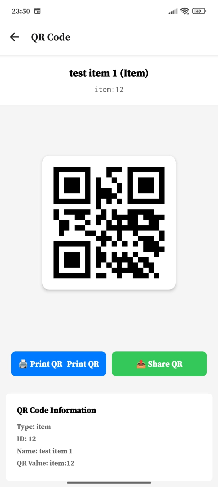
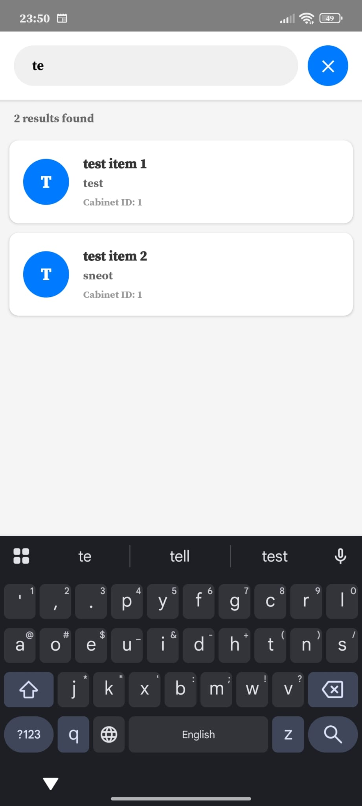

# messy

React Native app to organize items based on QR codes.

Each item is associated with a QR code and the same applies for each cabinet.

You can scan a QR to view the details of the scanned item/cabinet.

You can bulk move items from one cabinet to another.

You can search for items.

The app was built with opencode (for everything react) and manually for the php
stuff.

# some photos of the app on android

- list of cabinets


- list of items in a cabinet


- item landing page


- item qr


- search


# create the database

## sqlite

initial plan to use sqlite3

```
sqlite3 messy.db
create table cabinets (id integer primary key, name text not null, description text, photo text);
create table items (id integer primary key, name text not null, description text, photo text, cabinet_id integer, foreign key (cabinet_id) references cabinets(id));
insert into cabinets (name, description, photo) values ('dulap1', 'dummy dulap', NULL);
insert into items (name, description, photo, cabinet_id) values ('item1', 'dummy item', 'turtle.png', 1);

select * from cabinets;
select * from items;
```

## mysql (support not available yet)

using mysql so you'll have to create the database in the mysql cli
```
create database messy;
use messy;
create table cabinets (id integer auto_increment primary key, name text not null, description text, photo text);
create table items (id integer auto_increment primary key, name text not null, description text, photo text, cabinet_id integer, foreign key (cabinet_id) references cabinets(id));
insert into cabinets (name, description, photo) values ('dulap1', 'dummy dulap', NULL);
insert into items (name, description, photo, cabinet_id) values ('item1', 'dummy item', 'turtle.png', 1);
```

# run the app

- start the php server
```
php -S 0.0.0.0:8005 -c php.ini
```

- start the app for the browser
```
yarn start --web
```

- start the app for android for when you need to first load it; you'll need to
  plug in your device and have the usb debugging on, and also enable installing
  an apk over usb. this will first install the expo-go app which is used to
  do over the air updates to the app if anything changes
```
yarn start --android
```

After the app is loaded you can just `yarn start --web` and it should update
the app when you start it via expo (given you are on the same network, you no
longer need the cable)

# Incoming features

- printing should be done via a thermal cat printer by the php api server, or
  directly to an esp32 that would manage the printer.
- searching filters, search by description instead of name (maybe add a count
  to each item if you want to keep track of what you have in order to restock
  when out)
